# 🗳️ SecureVote - Decentralized E-Voting Platform

<div align="center">

[](https://securevoting.vercel.app)
[](https://etherscan.io)
[](https://webauthn.io)
[](LICENSE)

*A next-generation decentralized voting platform combining Web3 blockchain technology with biometric security*

[🚀 Live Demo](https://securevoting.vercel.app) • [📱 Mobile Compatible](https://securevoting.vercel.app) • [🔗 Backend API](https://dvotingsoftware.onrender.com)

</div>

---

## 🌟 Key Highlights

🔥 **REAL Web3 Integration** - Connect MetaMask wallet and vote on Ethereum blockchain  
🔐 **Biometric Authentication** - Fingerprint/FaceID login with WebAuthn API  
📱 **Mobile Optimized** - Native mobile biometric support  
⚡ **Real-time Results** - Live vote counting with blockchain verification  
🛡️ **Military-grade Security** - End-to-end encryption with immutable audit trail  
🎯 **Enterprise Ready** - Production deployment on Vercel + Render  

---

## ✨ Revolutionary Features

### 🔗 **Blockchain Integration (Web3)**
- **Smart Contract Voting** - Deploy votes directly to Ethereum blockchain
- **MetaMask Connection** - Real wallet integration for your college demo
- **Immutable Audit Trail** - Every vote permanently stored on blockchain
- **Gas Optimization** - Efficient smart contract design for cost-effective voting
- **Multi-Network Support** - Ethereum mainnet & testnets compatibility

### 🔐 **Advanced Security Features**
- **WebAuthn Biometrics** - Real fingerprint/FaceID authentication
- **Mobile Biometric Support** - Native iOS/Android fingerprint sensors
- **Multi-factor Authentication** - OTP + Biometric verification
- **Aadhaar Integration** - Identity verification with government ID
- **Anti-tampering Protection** - Blockchain-backed vote integrity

### 🎛️ **Admin Powerhouse**
- **Real-time Dashboard** - Live election monitoring with statistics
- **Bulk User Management** - Import/export voter data with safety controls
- **Election Analytics** - Comprehensive voting pattern analysis
- **Audit Logging** - Complete admin action tracking
- **Emergency Controls** - Secure election pause/resume capabilities

### 📱 **Modern User Experience**
- **Progressive Web App** - Mobile app-like experience
- **Dark/Light Mode** - Adaptive UI themes
- **Offline Capability** - Vote queue with auto-sync
- **Real-time Notifications** - Live voting updates
- **Responsive Design** - Seamless desktop to mobile experience

---

## 🛠️ Tech Stack

### **Frontend (Next-Gen)**
```typescript
⚛️  React 18 + TypeScript     // Type-safe component architecture
⚡  Vite                      // Lightning-fast development
🎨  Tailwind CSS              // Utility-first styling
🔗  Web3 Integration          // Ethereum blockchain connectivity
📱  WebAuthn API              // Biometric authentication
🎯  React Router             // Client-side routing
🎪  Context API              // Global state management
```

### **Backend (Enterprise)**
```javascript
🚀  Express.js               // RESTful API server
🍃  MongoDB + Mongoose       // NoSQL database with ODM
🔐  JWT Authentication       // Stateless auth tokens
🌐  WebAuthn Server          // Biometric verification
📧  OTP Integration          // SMS/Email verification
🔒  CORS & Security          // Production-ready security
```

### **Blockchain (Web3)**
```solidity
⛓️  Ethereum Blockchain      // Decentralized vote storage
🔗  Smart Contracts          // Solidity-based voting logic
💰  MetaMask Integration     // Wallet connectivity
⚡  Gas Optimization         // Cost-efficient transactions
🛡️  Immutable Audit         // Tamper-proof vote records
```

### **DevOps & Deployment**
```yaml
☁️  Vercel (Frontend)        // Edge-optimized hosting
🚀  Render (Backend)         // Scalable API deployment
🌍  CDN Integration          // Global content delivery
📊  Real-time Monitoring     // Performance analytics
🔄  CI/CD Pipeline           // Automated deployments
```

---

## 🚀 Quick Start Guide

### 📋 Prerequisites
```bash
📦 Node.js 18.x or higher
🍃 MongoDB Atlas account or local instance  
🔗 MetaMask wallet (for Web3 features)
⚡ Git version control
```

### ⚡ Lightning Setup

1. **Clone the powerhouse repository:**
```bash
git clone https://github.com/Varununknown/Dvotingsoftware.git
cd Dvotingsoftware
```

2. **Install frontend dependencies:**
```bash
npm install
```

3. **Install backend dependencies:**
```bash
cd backend && npm install && cd ..
```

4. **Configure environment variables:**
```bash
# Frontend (.env)
VITE_API_URL=https://dvotingsoftware.onrender.com
VITE_ENABLE_WEB3=true

# Backend (backend/.env)
MONGO_URI=your_mongodb_connection_string
JWT_SECRET=your_super_secret_key
PORT=5000
```

5. **Launch development environment:**
```bash
npm run dev:full
```

🎉 **Boom!** Your app is now running:
- **Frontend**: http://localhost:5173
- **Backend**: http://localhost:5000

---

## 🔗 Web3 Blockchain Setup

### 🦊 MetaMask Integration

1. **Install MetaMask browser extension**
2. **Create/Import wallet** with demo phrase (for testing)
3. **Connect to Ethereum network** (Mainnet/Testnet)
4. **Fund wallet** with test ETH for gas fees

### ⛓️ Smart Contract Deployment

```solidity
// Smart Contract Features:
✅ Immutable vote storage on blockchain
✅ Real-time vote counting with gas optimization  
✅ Audit trail for complete transparency
✅ Anti-double-voting protection
✅ Emergency pause/resume capabilities
```

### 🔧 Blockchain Configuration

```typescript
// Update contract details in src/contracts/contractInfo.ts
export const CONTRACT_ADDRESS = "0x..."; // Your deployed contract
export const CONTRACT_ABI = [...];       // Contract interface
export const SUPPORTED_NETWORKS = {
  1: "Ethereum Mainnet",
  11155111: "Sepolia Testnet"
};
```

---

## 📱 Mobile Biometric Setup

### 🔐 WebAuthn Configuration

Our platform supports **REAL mobile biometric authentication**:

```typescript
✅ iOS Face ID / Touch ID
✅ Android Fingerprint
✅ Windows Hello  
✅ Hardware security keys
✅ Passkey authentication
```

### 📲 Mobile Testing

1. **Open on mobile device**: https://securevoting.vercel.app
2. **Register with biometrics** - Your fingerprint sensor will activate
3. **Login with biometrics** - One-tap authentication
4. **Vote securely** - Biometric-protected ballot casting

---

## 🏗️ Production Deployment

### ☁️ Frontend (Vercel)

```bash
# Automatic deployment via GitHub integration
git push origin main  # Auto-deploys to Vercel
```

**Live URL**: https://securevoting.vercel.app

### 🚀 Backend (Render)

```bash
# Automatic deployment via GitHub integration  
git push origin main  # Auto-deploys to Render
```

**API URL**: https://dvotingsoftware.onrender.com

### 🔧 Production Configuration

```yaml
# Vercel (vercel.json)
{
  "framework": "vite",
  "buildCommand": "npm run build:prod",
  "outputDirectory": "dist"
}

# Render (render.yaml)  
services:
  - type: web
    name: dvoting-backend
    env: node
    buildCommand: npm install
    startCommand: npm start
```

---

## 📁 Project Architecture

```
SecureVote/
├── 🎨 Frontend (React + TypeScript)
│   ├── src/
│   │   ├── components/
│   │   │   ├── admin/           # Admin dashboard & controls
│   │   │   └── voter/           # Voter registration & voting
│   │   ├── contexts/            # React state management
│   │   ├── contracts/           # Smart contracts & Web3
│   │   ├── services/            # API & blockchain services
│   │   └── utils/               # Helper functions
│   └── public/                  # Static assets & models
│
├── 🚀 Backend (Express + MongoDB)  
│   ├── models/                  # Database schemas
│   ├── routes/                  # API endpoints
│   │   ├── voterRoutes.js      # Voter management
│   │   ├── electionRoutes.js   # Election CRUD
│   │   └── votingRoutes.js     # Vote casting
│   └── server.js               # Express server
│
├── ⛓️ Blockchain (Solidity)
│   ├── DecentralizedVoting.sol # Main voting contract
│   └── contractInfo.ts         # Contract configuration
│
└── 🔧 DevOps
    ├── docker-compose.yml       # Container orchestration
    ├── Dockerfile              # Container configuration  
    └── nginx.conf              # Reverse proxy setup
```

---

## 🎯 Core Features Deep Dive

### 🗳️ **Voting Flow**

```mermaid
graph LR
    A[👤 Voter] --> B[🔐 Biometric Auth]
    B --> C[📋 View Elections] 
    C --> D[🗳️ Cast Vote]
    D --> E[⛓️ Blockchain Storage]
    E --> F[📜 Receipt Generation]
```


### 🛡️ **Security Layers**
```typescript
Layer 1: 🔐 WebAuthn Biometric Authentication
Layer 2: 📱 Multi-factor OTP Verification  
Layer 3: 🔑 JWT Token-based Authorization
Layer 4: ⛓️ Blockchain Immutable Storage
Layer 5: 🛡️ End-to-end Encryption
```

### 📊 **Admin Analytics**
- **Real-time Vote Tracking** with live charts
- **Voter Demographics** and participation stats
- **Election Performance** metrics and insights
- **Security Audit Logs** for compliance
- **Blockchain Verification** of vote integrity

---

## 🧪 Testing & Development

### 🔬 **Testing Framework**
```bash
# Frontend Testing
npm run test:frontend

# Backend API Testing  
npm run test:backend

# Blockchain Contract Testing
npm run test:contracts

# End-to-end Testing
npm run test:e2e
```

### 🐛 **Debugging Tools**
- **React DevTools** for component inspection
- **MongoDB Compass** for database monitoring  
- **MetaMask** for blockchain transaction debugging
- **Browser DevTools** for WebAuthn debugging

### 🔧 **Development Commands**
```bash
npm run dev:full         # Start full development environment
npm run build:prod       # Production build
npm run lint            # Code linting
npm run format          # Code formatting
npm run analyze         # Bundle analysis
```

---

## 🤝 Contributing

We welcome contributions! Please follow our contribution guidelines:

### 🔄 **Development Workflow**
1. **Fork** the repository
2. **Create** feature branch: `git checkout -b feature/amazing-feature`
3. **Commit** changes: `git commit -m 'Add amazing feature'`
4. **Push** to branch: `git push origin feature/amazing-feature`
5. **Submit** a Pull Request

### 📝 **Code Standards**
- **TypeScript** for type safety
- **ESLint** for code quality
- **Prettier** for formatting
- **Conventional Commits** for git messages

---

## 📞 Support & Contact

### 🆘 **Need Help?**
- 📧 **Email**: varun@securevote.app
- 🐛 **Issues**: [GitHub Issues](https://github.com/Varununknown/Dvotingsoftware/issues)
- 💬 **Discussions**: [GitHub Discussions](https://github.com/Varununknown/Dvotingsoftware/discussions)

### 🎓 **Academic Use**
Perfect for college projects! This codebase demonstrates:
- ✅ **Modern Web Development** (React + TypeScript)
- ✅ **Blockchain Integration** (Real Web3 implementation)
- ✅ **Security Best Practices** (Biometric auth + encryption)
- ✅ **Production Deployment** (Live demo available)
- ✅ **Professional Documentation** (Industry-standard README)

---

## 📄 License

This project is licensed under the **MIT License** - see the [LICENSE](LICENSE) file for details.

---

## 🙏 Acknowledgments

### 🔧 **Technologies**
- [React](https://reactjs.org/) - Frontend framework
- [Express](https://expressjs.com/) - Backend server
- [MongoDB](https://www.mongodb.com/) - Database
- [Ethereum](https://ethereum.org/) - Blockchain platform
- [WebAuthn](https://webauthn.io/) - Biometric authentication
- [Vercel](https://vercel.com/) - Frontend hosting
- [Render](https://render.com/) - Backend hosting

### 🌟 **Special Thanks**
- **DSATM College** for project support
- **Open Source Community** for amazing tools
- **Ethereum Foundation** for blockchain infrastructure
- **W3C** for WebAuthn specification

---

<div align="center">

### 🚀 **Ready to revolutionize voting?**

[](https://vercel.com/new/clone?repository-url=https://github.com/Varununknown/Dvotingsoftware)
[](https://securevoting.vercel.app)

**Built with ❤️ by Varun** | **Powered by Web3 & Biometrics** | **Ready for the Future**

</div>